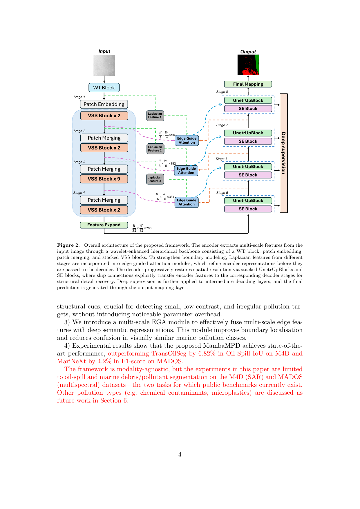

<h1 align="center"> MambaMPD: A Mamba-Driven Segmentation Framework for Marine Pollution Detection from Remote Sensing Imagery </h1>

<h5 align="center"><em>Shuaiyu Chen, Wei Han, Peng Ren, Chunbo Luo, and Zeyu Fu</em></h5>

<p align="center">
  <a href="#introduction">Introduction</a> |
  <a href="#architecture">Architecture</a> |
  <a href="#results">Results</a> |
  <a href="#installation">Installation</a> |
  <a href="#datasets">Datasets</a> |
  <a href="#usage">Usage</a> |
  <a href="#acknowledgement">Acknowledgement</a>
</p>

## Introduction

This is the official implementation of the paper *"MambaMPD: A Mamba-Driven
Segmentation Framework for Marine Pollution Detection from Remote Sensing
Imagery."*

**Abstract.** Accurate detection of marine pollution is essential for protecting
coastal ecosystems and marine biodiversity. Vision Mamba-based approaches are
promising for remote-sensing semantic segmentation thanks to their ability to
efficiently capture long-range dependencies, but their potential is largely
unexplored for Marine Pollution Detection (MPD), which poses distinct challenges:
low signal-to-noise ratios, spatial fragmentation of pollution patterns, and
indistinct boundaries between pollutants and the surrounding marine environment.
**MambaMPD** enhances a Mamba encoder with two complementary modules — the
**Frequency-Aware Augmentation (FAA)** module, which injects multi-scale wavelet
frequency cues, and the multi-scale **Edge-Guided Attention (EGA)** module, which
fuses Laplacian-derived boundary cues into deep semantic features. A U-Net-style
**SE-ResDecoder** with squeeze-and-excitation attention and deep supervision
progressively recovers spatial detail. On M4D, MambaMPD improves Oil-Spill IoU by
6.82% over TransOilSeg; on MADOS it surpasses MariNeXt by 4.2% in F1.

<figure>
<div align="center">

</div>
</figure>

## Architecture

MambaMPD is composed of four parts:

| Component | File | Description |
| :-- | :-- | :-- |
| **VSS encoder** | [`models/vss_encoder.py`](models/vss_encoder.py) | Hierarchical Visual State Space encoder (VMamba-Tiny / Swin-UMamba), stages `{2, 2, 9, 2}`, dims `[96, 192, 384, 768]`. |
| **FAA** | [`models/faa.py`](models/faa.py) | Frequency-Aware Augmentation: frozen Haar wavelet decomposition (J = 2) + per-sub-band refinement + IWT, SE recalibration, 7×7 depthwise conv + InstanceNorm. Placed before patch embedding. |
| **EGA** | [`models/ega.py`](models/ega.py) | Edge-Guided Attention: multi-scale Laplacian edge prior from the decoder's auxiliary prediction, global/local feature extractors, edge modulation, residual fusion, and edge-aware ECA channel attention (Eq. 5–7, Table 1). |
| **SE-ResDecoder** | [`models/mambampd.py`](models/mambampd.py) | UnetrUpBlock + SE block per stage, with deep supervision; the three mid-level skip features are refined by EGA before decoding. |

The full model is assembled in [`models/mambampd.py`](models/mambampd.py) and
constructed via `build_mambampd(num_classes=5)`.

## Results

### M4D (SAR, 5 classes) — per-class IoU / mIoU

| Model | Sea Surface | Oil Spill | Look-alike | Ship | Land | mIoU |
| :-- | :--: | :--: | :--: | :--: | :--: | :--: |
| DeepLabv3+ | 96.43 | 53.38 | 55.40 | 27.63 | 92.44 | 65.06 |
| SAM-OIL | 96.05 | 51.60 | 55.60 | 52.55 | 91.81 | 69.52 |
| TransOilSeg | 97.02 | 61.38 | 62.41 | 33.49 | 94.39 | 69.74 |
| OSDMamba | 96.47 | 65.59 | 47.57 | 46.85 | 94.76 | 70.25 |
| **MambaMPD (ours)** | 96.30 | **68.20** | 43.60 | 49.39 | 93.79 | **70.85** |

### MADOS (multispectral) — F1 / mIoU

| Model | F1 | mIoU | OA |
| :-- | :--: | :--: | :--: |
| MariNeXt | 70.6 | 59.2 | 81.6 |
| OSDMamba | 71.2 | 68.1 | 82.3 |
| **MambaMPD (ours)** | **74.8** | **69.8** | 83.1 |

### Ablation (M4D) — Oil-Spill IoU / mIoU

| FAA | SER | EGA | Oil Spill | mIoU |
| :--: | :--: | :--: | :--: | :--: |
|  |  |  | 53.90* | 64.97 |
| ✓ |  |  | 66.97 | 67.58 |
|  | ✓ |  | 66.70 | 67.72 |
|  |  | ✓ | 65.46 | 68.30 |
| ✓ | ✓ | ✓ | **68.20** | **70.85** |

<sub>*Numbers are reported from the paper. The baseline corresponds to a plain
MambaU-Net (VSS encoder + standard UnetrUpBlock decoder). FAA / SER / EGA can be
toggled with the `--use_faa` / `--use_ega` flags and the `deep_supervision`
switch.</sub>

## Installation

```bash
pip install -r requirements.txt
```

The VSS encoder relies on the [`mamba-ssm`](https://github.com/state-spaces/mamba)
selective-scan CUDA kernels, which require an NVIDIA GPU and a matching CUDA
toolchain. FAA additionally uses `PyWavelets`, and the decoder blocks come from
`monai`.

The ImageNet-pretrained VMamba-Tiny encoder checkpoint is provided at
[`pretrained/vssmtiny_dp01_ckpt_epoch_292.pth`](pretrained/) and is loaded into
the VSS encoder at the start of training (the patch-embed / classification head /
final norm are skipped).

## Datasets

**M4D** (Krestenitis et al., 2019) — SAR oil-spill dataset, 1002 train / 110 test
images, 5 classes (sea surface, oil spill, look-alike, ship, land). Single-channel
SAR intensity is replicated to 3 channels and normalised with `mean = 0.5185`,
`std = 0.197`. Expected layout:

```
<M4D root>/
├── train/
│   ├── images/        # *.jpg
│   └── labels_1D/     # *.png  (single-channel class ids)
└── test/
    ├── images/
    └── labels_1D/
```

**MADOS** (Kikaki et al., 2024) — Sentinel-2 multispectral marine-pollution
dataset, 11 bands resampled to 10 m, 15 thematic classes, **sparse** annotations
(unannotated pixels are labelled `-1` and ignored). Download from
[Zenodo](https://doi.org/10.5281/zenodo.10664073) and place under `./data/MADOS`
with the official `splits/{train,val,test}_X.txt`. The MADOS pipeline integrates
the official MADOS / MariNeXt training framework (sparse-label dataset, VSCP
augmentation, weighted cross-entropy, EMA, multi-step schedule, pixel-level
metrics) but uses the MambaMPD model: the stem/patch-embed accepts `Cin = 11`
(randomly initialised) while the rest of the encoder keeps its ImageNet-pretrained
weights. Patches are 240×240 and are resized to 256 (divisible by 32) for the
model; logits are upsampled back to the annotation resolution for loss and
metrics.

## Usage

**Train** on M4D:

```bash
python train.py \
    --dir_dataset "/path/to/M4D Oil Spill Detection Dataset" \
    --pretrained_ckpt pretrained/vssmtiny_dp01_ckpt_epoch_292.pth \
    --batch_size 8 --num_epochs 100 --learning_rate 0.001 --which_optimizer sgd
```

Key hyper-parameters (see [`config/mambampd_m4d.yaml`](config/mambampd_m4d.yaml)):
SGD (momentum 0.9, weight decay 1e-4), initial LR 1e-3 with "Poly" decay, batch
size 8, 100 epochs, hybrid Focal + Jaccard loss, deep supervision.

**Evaluate** on the M4D test set:

```bash
python eval.py \
    --dir_dataset "/path/to/M4D Oil Spill Detection Dataset" \
    --file_model_weights mambampd/mambampd_best.pt \
    --dir_save_preds preds/
```

**Ablations** — disable individual modules:

```bash
python train.py ... --use_faa 0            # without FAA
python train.py ... --use_ega 0            # without EGA
python train.py ... --deep_supervision 0   # without deep supervision
```

**Train / evaluate on MADOS** (multispectral):

```bash
python train_mados.py --path ./data/MADOS \
    --pretrained_ckpt pretrained/vssmtiny_dp01_ckpt_epoch_292.pth \
    --batch 4 --epochs 100

python eval_mados.py --path ./data/MADOS \
    --model_path trained_models_mados/model_best.pth --split test
```

MADOS hyper-parameters (see [`config/mambampd_mados.yaml`](config/mambampd_mados.yaml)):
Adam (LR 2e-4) with a multi-step schedule, batch size 4, 100 epochs, weighted
cross-entropy over annotated pixels with deep supervision, VSCP augmentation and
optional EMA.

**Demo app:**

```bash
streamlit run app.py
```

## Repository layout

```
MambaMPD/
├── models/             # MambaMPD, VSS encoder, FAA, EGA
├── utils/              # M4D + MADOS datasets, metrics, losses, logging
│   ├── dataset.py          # M4D (SAR)
│   ├── losses.py           # hybrid Focal+Jaccard + deep supervision
│   ├── metrics.py
│   ├── mados_dataset.py     # MADOS (multispectral) + VSCP
│   ├── mados_metrics.py     # MADOS pixel-level evaluation
│   └── mados_assets.py      # MADOS labels / TTA / schedules
├── config/             # YAML configs (M4D + MADOS)
├── Figure/             # architecture figure
├── pretrained/         # ImageNet-pretrained VMamba-Tiny encoder
├── train.py / eval.py            # M4D (SAR) training & evaluation
├── train_mados.py / eval_mados.py  # MADOS (multispectral) training & evaluation
└── app.py              # Streamlit demo
```

## Acknowledgement

This implementation builds on [VMamba](https://github.com/MzeroMiko/VMamba),
[Swin-UMamba](https://github.com/JiarunLiu/Swin-UMamba),
[OSDMamba](https://github.com/Multimodal-Intelligence-Lab-MIL), the
[HTSM oil-spill segmentation](https://github.com/AbhishekRS4/HTSM_Oil_Spill_Segmentation)
training template, [MONAI](https://github.com/Project-MONAI/MONAI), and
[segmentation_models.pytorch](https://github.com/qubvel/segmentation_models.pytorch).
We thank the authors of the M4D and MADOS datasets.

## Statement

The source code is released for research purposes only. If you find this work
useful, please cite the MambaMPD paper.
